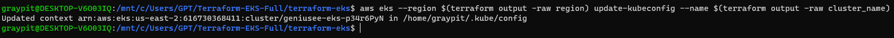
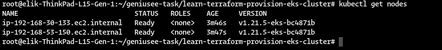
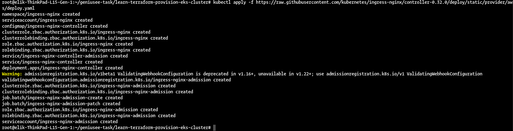
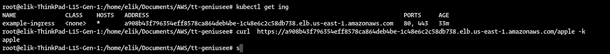
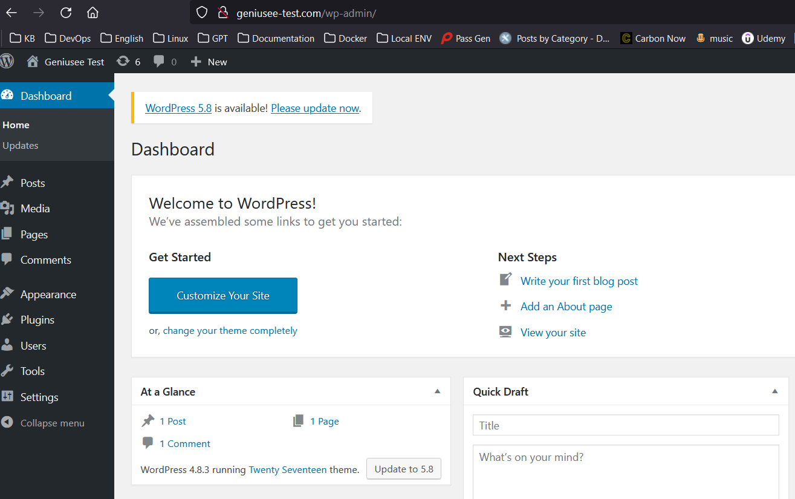
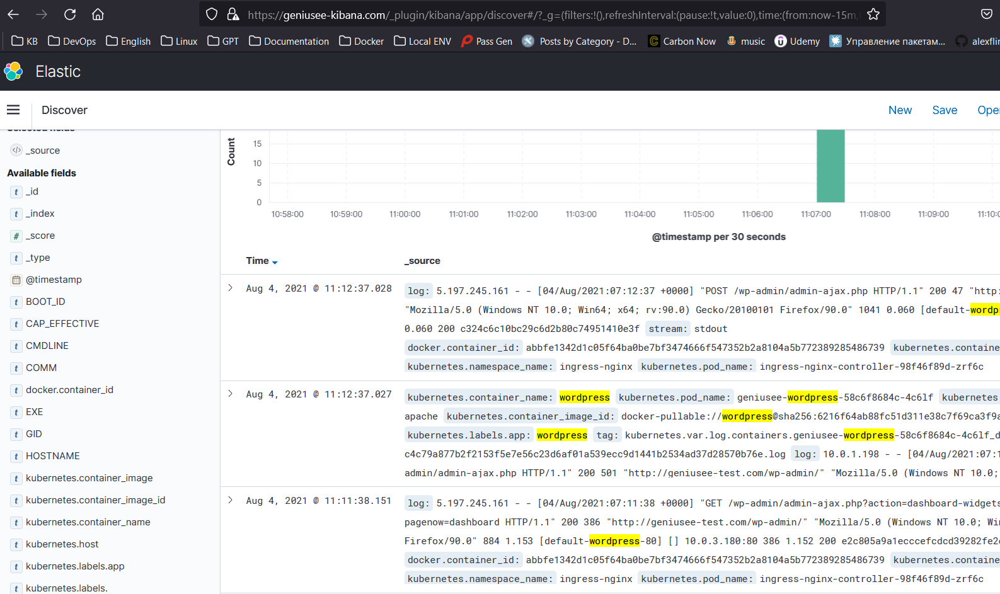

#Author Mammadov Elbrus
# Geniusee Task 


### AWS EKS:
- Ingress Controller (NLB)
- Fluentd DS
- Wordpress Deployment with PV
- Mysql for Wordpress with PV
### AES with Kibana
- ElasticSearch Engine / Kibana

## Prerequisites
The README assumes some basic familiarity with Kubernetes and kubectl but does not assume any pre-existing deployment.

It also assumes that you are familiar with the usual Terraform plan/apply workflow.

To start using, you will need:

- AWS account with the IAM permissions listed on the EKSmodule documentation
- Configured AWS CLI
- AWS IAM Authenticator
- terraform
- kubectl
- wget (required for the eks module)
- Ansible
- AWS EC2 

## Configure AWS
Configure it by running `aws configure`

When prompted, enter your AWS Access Key ID, Secret Access Key, region and output format.
```bash
$ aws configureAWS Access Key ID [None]:
$ YOUR_AWS_ACCESS_KEY_IDAWS Secret Access Key [None]: 
$ YOUR_AWS_SECRET_ACCESS_KEYDefault region name [None]: 
$ YOUR_AWS_REGIONDefault output format [None]: json
```
## Quick Install:
Just run the the ansible-playbook:
```bash
$ ansible-playbook setup.yaml
```
# The EKS/AES Seperate Clusters


## Provision IaaC by Terraform
## Initialize Terraform workspace with upgrades
```bash
$ terraform init -upgrade
```
## Then check your codes
```bash
$ terraform plan
```
## Provision your Infrastructure, just run the following
```bash
$ terraform apply --auto-approve
```
## Configure kubectl
Now that you've provisioned your EKS cluster, you need to configure kubectl
I used two options, the first is terraforming and the second is eksctl

1)Run the following command to retrieve the access credentials for your cluster and automatically configure kubectl.
```bash
$ aws eks --region $(terraform output -raw region) update-kubeconfig --name $(terraform output -raw cluster_name)
```
2)And Run with eksctl but you set variables for this options
```bash
export AWS_ACCESS_KEY_ID=<>
export AWS_SECRET_ACCESS_KEY=<>
export AWS_DEFAULT_REGION=us-east-1
export KUBECONFIG=~/.kube/config-eks-cluster

eksctl create cluster --name geniusee-cluster --version 1.15 \
        --region us-east-1 --zones "us-east-1b,us-east-1c" \
	--nodegroup-name standard-workers --node-type m5a.4xlarge \
         --nodes 5 --nodes-min 1 --nodes-max 7 --node-ami auto \
	--full-ecr-access --appmesh-access --alb-ingress-access \
	--kubeconfig ${KUBECONFIG}
```



## Network Load Balancer with the NGINX Ingress resource in EKS
Start by creating the mandatory resources for NGINX Ingress in your cluster:
```bash
$ kubectl apply -f https://raw.githubusercontent.com/kubernetes/ingress-nginx/controller-0.32.0/deploy/static/provider/aws/deploy.yaml
```
FYI: The above manifest file also launches the Network Load Balancer(NLB)


## FYI: Default ES/Kibana Credentials:
- ES Username geniusee-user
- ES Password `Geniusee@!@!@!`

## Then, deploy the Fluentd to EKS
```bash
kubectl apply -f ./manifests/fluentd.yml
```

## Kibana Access UI via Ingress
Set the `Elasticsearch` Host into the `./manifests/kibana-svc-ing.yml` file and apply it
```bash
$ kubectl apply -f ./manifests/kibana-svc-ing.yml
```
## Get the IP from Ingress LB External Service
```bash
$ kubectl -n ingress-nginx get svc
```

## Add Records to your local hosts file
```bash
<ingress.ip> geniusee-test.com geniusee-kibana.com
```
## Deploy the Apache Wordpress/MySQL DB
We use here the `kustomization` method
```bash
$ kubectl apply -k ./manifests/
```
## Check the result
- http://geniusee-test.com

- https://geniusee-kibana.com/_plugin/kibana



#### Useful Documentation:

- https://aws.amazon.com/blogs/opensource/network-load-balancer-nginx-ingress-controller-eks/
- https://docs.aws.amazon.com/eks/latest/userguide/network-load-balancing.html
- https://learn.hashicorp.com/tutorials/terraform/eks
- https://kubernetes.io/docs/tutorials/stateful-application/mysql-wordpress-persistent-volume/
- https://docs.aws.amazon.com/elasticsearch-service/latest/developerguide/es-kibana.html
- https://faun.pub/sending-kubernetes-logs-to-amazon-elasticsearch-service-8fb8f18ac35d
- https://github.com/fluent/fluentd-kubernetes-daemonset
- https://medium.com/kubernetes-tutorials/exporting-kubernetes-logs-to-elasticsearch-using-fluent-bit-758e8de606af
- https://registry.terraform.io/providers/hashicorp/aws/latest/docs/resources/elasticsearch_domain