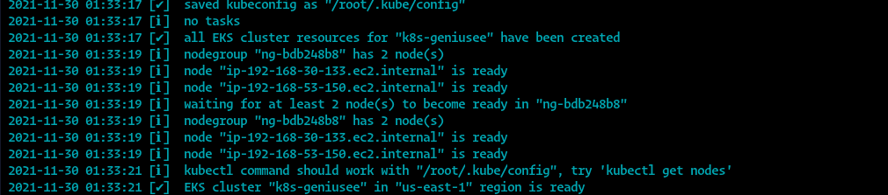

# Author Mammadov Elbrus
# Geniusee Task 


### AWS EKS:
- Ingress Controller (NLB)
- Fluentd DS
- Wordpress Deployment with PV
- Mysql for Wordpress with PV
### AES with Kibana
- ElasticSearch Engine / Kibana

## Prerequisites
The README assumes some basic familiarity with
the task that they gave me
Requirements for starting the task basic knowledge of Kubernetes and kubectl, eksctl, load balancer, kafka, elastic.
Exercise:
Geniusee DevOps
Test Task:
Run Kubernetes cluster on AWS/GCP/Bare metal with EFK stack
Conditions:
-
-
-
-
You have to use Terraform to describe all infrastructure;
You have to create a Deployment with Apache server and expose it through a Load
Balancer;
All k8s logs should be captured and delivered to an Elasticsearch cluster;
Kubernetes and Elasticsearch clusters should be separated (use AWS Elasticsearch if
possible);
Optional (advanced):
-
Deploy a Wordpress site instead of default Apache service into k8s, expose it
through a Load Balancer and catch logs via EFK stack;
The entire process should be as automated as possible and all services should be raised by
one command only.
Push your code to a github.com repository.

## Configure AWS
Since I have several profiles in the aws folder I will use default but you can also create a new user using this link https://docs.aws.amazon.com/AWSEC2/latest/UserGuide/security-iam.html and add it using the following commands.

Configure it by running `aws configure`
When prompted, enter your AWS Access Key ID, Secret Access Key, region and output format.
```bash
$ aws configureAWS Access Key ID [None]:
$ YOUR_AWS_ACCESS_KEY_IDAWS Secret Access Key [None]: 
$ YOUR_AWS_SECRET_ACCESS_KEYDefault region name [None]: 
$ YOUR_AWS_REGIONDefault output format [None]: json
```
## Quick Install:
For complete automation of the script, I wrote ansible which will perform all the actions for you automatically and with the help of the debug module will notify you about the progress of the entire script:
```bash
$ ansible-playbook setup.yaml
```
# The EKS/AES Seperate Clusters
<img src="data:image/png;base64,iVBORw0KGgoAAAANSUhEUgAAASwAAACoCAMAAABt9SM9AAABBVBMVEX///8ybeZEcsQ7jvc3e/Y3efY7jPc4gfc3ePY6ivc/XNM5h/c5hfc3ffY6ifc4f/YhZeU7bcSXpcavwfNCYtNDZdM9WdNFadRCY9M9V9NBX9M7VNNHbdQsaubz9fwdY+XZ4PXm7fzK3/y5xO1IcNQSX+Rcmvh4m+3u8/1uo/g6c+fV4PlZbNiBoe5DeOjB0fdSgulQgOmet/JvpPhmj+spcfaw0Ps0TdLU2fSQrvVgjfGWsfEmRtDc3+fs7fIAWuM0Ya1olviaw/ptfd5Dlfh/jeCIluKToOWkr+jH1vpxrPmKuvnY6P2wueyKmuJkddsgUp5Ga64nX7iFlrpkgdptjNyvwOs9XdR/AAAMZElEQVR4nO2caXvaxhaAISxm96RsZpGETMQasE3wArR2nDR1aEl82yb+/z/ljma0zCZsxxKkz3PeL7GRFMYvZ47OLCIWAwAAAAAAAAAAAAAAAAAAAAAAAAAAAAAAAAAAAAAAAAAA+C8w6Hb23YT/CutTC1mjsr7vdtiYF6QZ3ZN9N0RN99TQ4hhjOtu7rsGHROHY/qH568erfTdGQu+eUVU2aDQb7LUxHxLpRJbIent5+bPpGsxGviqiS5uY+2qM/uH3dCLhyWq1Ln/91NlXYyT01Qhxqmw0rb8fXRe9bCLBycK6Wn/s7bPjMBcIiaaoLqM/3nlrThxViUSJkWXruttrZiCYE02tiuhC8+Odtub4XTrhkudkYV25z/vVtekHRJUfXcv1zlpzPMwmEqKslg/Wtb/b9HquKVKVFF3L3RRemz9ZVZKsBqZ1Wenuoiky66Wc1ePaZCr7Q9Ny5K3Z/JlOc67SnKyGy+XbPeg6OTNkVXE0jukjRW80RtHWqeZfWUFVmpPluWrUGpcfd5cYCA9niqjCjLCSueqIhkaryHQN/kqkBVOsLMYUodHaYZWql1OqqCJgIacBxxBaRFLrkHJddpUuOLJEV7VcrtH61omiKTLlUfANEOE2qLqhc1RbhN4ap1yXVKWzoixPlU2j8WkXVerCCJSBc9NJzAwKOqJrGXJrLnpZtaqsIItTRXTlvkaua7zNVRw9xMythZcxC7MxW1TxsiRVVNddxLomW11YOLLUqd9Bm4bXlONhQAfMCrKUqprNZq7WjLZKPQv2gJA2x2es7B+Czwrrw9wMS9tUlfLviIcvjVaAKkKt+SWk9igYBASWZqB5eUzHXoNOua8F3S+NsGYu3ymqBV9VoecOSs2vrZboqslQ64TUIJm1l7I05PvQjGmZH6TqD6fsYX+wjcK6IbJ9UIqq3y+YMzufcE9Uu6pUKrlOSA2SWbl/Neqb41PnF2OqCpf10hGrjdaDmXudFtb90JclRRWnysbWpYiqSiVaWV7FaW1w+JwRBdYkIEvOLI2EIE5TzCAopJTqypJUJT4o3uHqW6smR1W0snQ/99g1gI5jS9PcsDK7E3vAPO6X3SQ+HmlxLY61xtZePzRCGmpQWWneVSmvVGWz/tZQqDo6ik7W2M/vyB7r6XMj7rzZyRwZlm1wfIPQ6QN9cTA1pvbxsp/uUUiVFpElqCqU/toyv9e9b+V4V0eYZiec9sjMmJshitshpdMoGpNJCGRHlmnYKX1E400f0IPMfTOkpDVMS2k9u02VTfe+xpuKVFafKwisifv6it76kG1oQMxo/kGaunxb4TRlmOVUYVd/Pl7C6Q/1XIV1Va1GJksXZvYsOqmnnzqRg+yZIt2JPjRygs7irokb4bTOkeW5yjKLI/r924pnrnt/f++PmvVPTSasqhHKGgslKanYMQ/OZDIiDXaOoRU9uBJGkyicaVMiK+uRf8cc0xuXv3acn7utRuue6Z7dHKsqQlllQZbhfpomramQfeOjczRo5B4b8NfEtX4obRmWGFWlEi+r1nJldRu11kc2lWFZjKoIZfEpK44m/qGZPR5EJNpxX9UM5lBZCK1pKJXWsMSoEmXlXFmfW7XWN+79ujlWVYSyRoIs+30GzvhljCtURD7CM9wpndprRsJLGCaGM5b2ZJUIBaWsz61c6xN/HZFVrUYuS5iqokXA6sbpVnrfoClsZiwdHSuLvLLgr0MPYTSmV2JUBci6w67+EK7DsqrVHcg6MRR/tBFHp06cu+Hu/tu3aMrvCLJCGUsTWa6qUp6X1WxcdmKxr9jVV/G6bo5zVa10wmiNzIr/oy07fmyB2lRZDOLq3hHDVxzhlKVYlmcKUxgyx/Rm7dKMfcKuPkvXdZuMqXq9ftQJozUyt3zyGdmvkYUvLS7vANGntlqNnDThL0yFseegl2dUibIqtRYeOucaipk9Rla9Hp0sYfmUlABOmapp4sKl6USTYYefUHIYYWyucWXl1bJyuVquqVp89mTV61HKEkpSUnS6azkaIolKny9PSa0V8+a67PviWrhSHktfXz/69te/cb9SWfm8UtZRDbvK1VUR7MqqRytrJsQHmY+hr2kWLZ76huYksIlFJ+LZs7yYnIv/9fX/fhNfkhDOwbLyDIKsXO1LO9dsK4oUIqvuU+08Q8HTEUpSogHHjIYsrd8lrsY3cW+1a7yYWnh4TeJvI5SlI+F/vv77nyfI+uc9e1Ivnw+WVc21zE692fwox5Yty1fVbkcjSy/GFbJutNOVl4LIGNrPSGZ5Hr+xZQm1gzOG9Lh+//r1v788yvtXrC1eVuGAl9VsmLFOvVL5JtnqNllVUckyhfAgEWSWuUifW5rBzRvra3uVRVyZ5cfS13+/fvXq9eO8esXa6hVYV4Ksui0r1qkeVd6IYytGVjs6WcItTTNWipPWS9WcwrGwMMaNpYmrp+LbYmQVCpKsSs3+EDv1auW7YMuT1W5HKKvPLG0ZSBs9Z3p4fRZHyPBtnzHHnuPq1ev37mWurAJFkHWUIxHfwQmcH0fHuhXGFKbeeb6Kx5l6rpbd9Zjtffr4ZDZZssthnWV/VT7mztmM1/7SPzuW/u1FkVVQympXqazYVVu0ZctqtyOW5e+OGXFJadWf4kgzNMRGywL/blhotFxwqdzb58atS78gZxUKj8iKjbEOrieum5yraGSdeGFBbvzjxWmfFMias7GBndzyhtyaZcva9Kd9YsfryfxGrafdDf99z98NC4yqYFmxK+zmO/tuX9pHjK43kcjy51nQ/KQ8xVkLkR0xXXf+ncZQl9yr3ZERzeQTXKoa8cUJswOH30zzQ3UWp+pAkEUTPOHqjRBbgy9vqq6qN2/anWdpeBrMlAPudnQxhwwI6SK1M5XQvxmxZ5OJCWcFg03w4sTDj1TwvKuDPJMG9bu7r36BdXW3uuOn0Aaf23WqKiJZV/IuNvon0yKKTm7hn2kBT+cJyaJrbCZfKY0Of2BsyKk6ODjMB61FqzDvsK7oZMWW8iYimqcfLHcqhkSZRj5TOz0h0glN6TKc9l4+SdM74FxhkvnHnk44vi16z/aZX2loRSNL8UdrdPg8s+gQkOZ1mumvkLuBVLFX0AhhJ7oj64DhMJkQ98+wbIapVDJT8Krmznc7uKKRFRvLoUVjB9syyAdGFzTIOkbs1JgTkyeWfFUY2x1sWQcih6lskK7NMJMpJjHnh74uHF0RyZLWtOLeFMMJiSZnDoemsjIdDYnrsr7hF4JlSa5IdPVUYWsuUlQV0eUbXX+vR7UJty//5ZZ/n/FWUy2/uWZcfpTnLJR1w55KlU0x2RNnYgeLYibpk8qc+8+qRbdhWfH0hOEF9eLGMhDGsE69lihchbQFN1AW1pUabpgz9dkhp8oG64r8ScjBSJG33NJdN/EQcTJZdcdu6JTlR+yc4uzl3BYDVB1ikkVPlz4rZARTVFfmNmpdihQUR1P1AoTel3M7E4gvZJ1W2jqkFJMp+kR7+UCpypZ1ft7bPPYuL0OR5OOGOmN3Fa64EeTL0D8UkocBrg6LxWKquNpcpKUO6KqyOc+E1ho1imd3yO1tzaXtDi4lHoJq/rDQZwe8LkaVDdahVkVdnZ/fRv7Au1zJ27PueFDYL683g8HAHHcnZ9bUxKNp6cwQKncOc8FEl6CqWExuU5U5v93BQ5qm+GCvHVhli06gxsnTBEiLozl9kbcafvPMRbJ4yJh6VFXGUVXazfOsHTFgBvY2IzGIrIH0UGtIe/4EzHfF4pNVuVGV39n3+fAjGONBXutyzJj8K+E/mkkZ91LFZ6k6jP4Bdx9+O01MWqy2IbmcDS15HTo8jnuppO8qubUHnidDfebxcdhxj703UlJlv37M9U4tnN2RQax7maflquTuv4BpylpYyRmLMGFvnFrUt+mLbCb5aAc8X+zhK1ZMZvuRFvQsJjvYCWuUs42LUmZ7B8zs6Xuq1luflZYwokruHOyQWRFVw4hHN8EoZtaDiTK5czjDZkUHzAx3//1UPorJrUBX0SZ3jsEilVFEVfQjm+0EfTWI7Cq0p8ifhDnJZDhV7Fzfvhg8VRba9ddfbt5RXe7I5mf4+s3jp3VEa8dFoM349twrrHZZrm+hHPgFPgxGeFNYz4Hq2u3IZjsnUwttx9D2EFeU9fI8td/vSxUZl7ez18w6/qlUAQAAAAAAAAAAAAAAAAAAAAAAAAAAAAAAAAAAAAAAAAAAAAAAAAAAAAAAAAAAAD8r/wewDbnqBYxbMQAAAABJRU5ErkJggg==">


## Provision IaaC by Terraform
## Initialize Terraform workspace with upgrades
```bash
$ terraform init -upgrade
```
## Then check your codes
```bash
$ terraform plan
```
## Provision your Infrastructure, just run the following
```bash
$ terraform apply --auto-approve
```
## Configure kubectl
Now that you've provisioned your EKS cluster, you need to configure kubectl

Run the following command to retrieve the access credentials for your cluster and automatically configure kubectl.
```bash
$ aws eks --region $(terraform output -raw region) update-kubeconfig --name $(terraform output -raw cluster_name)
```
2)And Run with eksctl
```bash
$ eksctl create cluster --name k8s-geniusee
```



## Network Load Balancer with the NGINX Ingress resource in EKS
Start by creating the mandatory resources for NGINX Ingress in your cluster:
```bash
$ kubectl apply -f https://raw.githubusercontent.com/kubernetes/ingress-nginx/controller-0.32.0/deploy/static/provider/aws/deploy.yaml
```
FYI: The above manifest file also launches the Network Load Balancer(NLB)


## FYI: Default ES/Kibana Credentials:
- ES Username geniusee-user
- ES Password `Geniusee@!@!@!`

## Then, deploy the Fluentd to EKS
```bash
kubectl apply -f ./manifests/fluentd.yml
```

## Kibana Access UI via Ingress
Set the `Elasticsearch` Host into the `./manifests/kibana-svc-ing.yml` file and apply it
```bash
$ kubectl apply -f ./manifests/kibana-svc-ing.yml
```
## Get the IP from Ingress LB External Service
```bash
$ kubectl -n ingress-nginx get svc
```

## Add Records to your local hosts file
```bash
<ingress.ip> geniusee-test.com geniusee-kibana.com
```
## Deploy the Apache Wordpress/MySQL DB
We use here the `kustomization` method
```bash
$ kubectl apply -k ./manifests/
```
## Check the result
- http://geniusee-test.com

- https://geniusee-kibana.com/_plugin/kibana


#### Useful Documentation:

- https://aws.amazon.com/blogs/opensource/network-load-balancer-nginx-ingress-controller-eks/
- https://docs.aws.amazon.com/eks/latest/userguide/network-load-balancing.html
- https://learn.hashicorp.com/tutorials/terraform/eks
- https://kubernetes.io/docs/tutorials/stateful-application/mysql-wordpress-persistent-volume/
- https://docs.aws.amazon.com/elasticsearch-service/latest/developerguide/es-kibana.html
- https://faun.pub/sending-kubernetes-logs-to-amazon-elasticsearch-service-8fb8f18ac35d
- https://github.com/fluent/fluentd-kubernetes-daemonset
- https://medium.com/kubernetes-tutorials/exporting-kubernetes-logs-to-elasticsearch-using-fluent-bit-758e8de606af
- https://registry.terraform.io/providers/hashicorp/aws/latest/docs/resources/elasticsearch_domain